# 생생탐험대 (Nature GO)

## 팀원

| 이름 | GitHub | 역할 |
|---|---|---|
| 주성민 | icoflroinity | 동정 모델 및 백엔드 |
| 허서준 | gjtjwns06 | 프론트엔드, 디자인 및 3D 모델링 |


---

## 기획안

**주제**: 생생탐험대 — 아이가 주변에서 만나는 동식물·곤충·버섯을 사진과 소리로 동정하고 도감을 채워가는 실외 생태교육 앱

**목적**: 아이가 직접 밖에 나가 생물을 관찰·촬영·녹음하면 AI가 종을 동정해 도감에 기록해준다. 확률형(가챠) 보상 없이 "실제 관찰"만으로 퀘스트·배지·경험치를 얻는 구조라, 자연을 관찰하고 배우는 행위 자체가 놀이이자 보상이 되도록 설계했다. 위험한 생물은 안전 경고를 먼저 보여주고, 식용 가능 여부처럼 잘못 알려주면 위험한 판단은 애초에 시도하지 않는다.

**핵심 기능**: 사진을 찍으면 BioCLIP 기반으로, 소리를 녹음하면 BirdNET 기반으로 종을 동정한다. 동정된 종은 실제 GPS 좌표와 함께 지도에 핀으로 남고 도감(Dex)에 해금된다. 관찰을 확정할 때마다 그 종의 "개체(친구)"가 한 마리씩 생기고, 이 개체들은 3D 홈가든(Unity 데스크톱 클라이언트)에서 온실 정원에 배치해 키울 수 있다. 관찰 이력을 기반으로 한 퀘스트·배지로 보상을 받으며, "아울 박사"에게 종에 대해 물어보면 미리 검수해둔 지식 문장을 의미 기반 검색으로 찾아 답해준다.

**클라이언트 구성**: 밖에서 쓰는 **모바일 앱(React Native/Expo)**, 집에서 수집물을 감상하는 **3D 홈가든(Unity 데스크톱)** — 두 개의 클라이언트가 하나의 백엔드와 계정을 공유한다. 두 클라이언트 모두 같은 `POST /auth/login`으로 발급받은 JWT를 쓰기 때문에, 밖에서 모바일로 동정한 생물이 같은 계정으로 접속한 3D 홈가든의 보유 목록에 그대로 나타난다. "밖에서 모으고, 집에서 기른다"는 흐름을 두 화면 크기에 맞게 나눈 구조다.

**예상 사용자**: 초등학생 등 아동, 그리고 아이와 함께 야외 활동을 하는 보호자.

**차별점**:
- 사진뿐 아니라 **소리(조류 울음)까지 동정 모달리티를 확장**했다. 두 파이프라인 모두 확신도 등급(high/medium/low/unknown)을 매기고, 노이즈·품질이 낮거나 헷갈리기 쉬운 종끼리 근접해 있으면 바로 단정하지 않고 사용자에게 확인을 유도한다.
- "아울 박사"는 생성형 LLM이 아니라 **검수된 문장에 대한 의미 기반 검색 + 안전 답변 하드코딩** 구조다. 그래서 아이에게 확인되지 않은 내용을 지어내는 대신, 모르면 모른다고 답한다.
- 위치·사진 데이터를 다루는 방식이 **타입 시스템 수준에서 강제**된다 — 정화(EXIF 제거)되지 않은 원본 사진은 애초에 컴파일되는 타입 자체가 없고, 위치는 "동의 시에만 저장되는 일반화된 지역"과 "동의와 무관하게 항상 저장되는 정밀 좌표(지도 핀용)"를 별개 필드로 분리해 둔다.
- 보상 체계가 **관찰 이벤트에서만 파생**되며 확률형 요소가 없다.
- **수집(모바일)과 감상(데스크톱)을 각 기기가 잘하는 쪽으로 분리**했다. 야외에서는 카메라·마이크·GPS가 있는 휴대폰이, 수집물을 3D로 감상할 때는 넓은 화면과 GPU가 있는 데스크톱이 맡는다. 같은 계정·같은 백엔드를 공유하므로 사용자에게는 하나의 서비스로 이어진다.

---

## 기능 명세서

코드에서 실제로 확인된 구현 상태 기준입니다.

### 구현됨

- [x] 회원가입 / 로그인 — 이메일+비밀번호, JWT 기반 인증 (`POST /auth/signup`, `POST /auth/login`)
- [x] 게스트 세션 — 계정 없이 체험 후 정식 계정으로 전환 가능 (`POST /session/guest`, `POST /session/guest/convert`)
- [x] 온보딩 동의 절차 — 개인정보/위치/사진 3단계 순차 동의 화면
- [x] 계정 설정 — 위치·사진 수집 동의 on/off, 데이터 복원, 계정 삭제(전체 데이터 삭제)
- [x] 사진 기반 종 동정 — 버스트 촬영 → 보정 → BioCLIP 동정 → 후보 확인 → 도감 확정 (`/sightings/upload`, `/identify`, `/identify/confirm`)
- [x] 카메라 프리뷰 탭 시 위험 여부 잠정 안내 (`POST /vision/preview-scan`, 무상태·미인증 공개 엔드포인트)
- [x] 소리 기반 조류 동정 — 녹음 → 품질 검사(노이즈/무음/클리핑) → BirdNET 기반 모델 동정 → 확정, 참조 음원과 유사도 채점 (`/audio/*`)
- [x] 도감(Dex) — 종 목록·완성도·상세 카드·관찰 사진 갤러리 (`/dex`, `/dex/completion`, `/species/:id/card`, `/species/:id/photos`)
- [x] 지도 — 카카오맵 기반, 내 관찰 핀·탐험 지역·현재 위치 표시 (`/map/pins`, `/map/explored-regions`)
- [x] 아울 박사 챗봇 — 의미 기반 검색 답변, 안전 질문 고정 답변, 추천 질문 (`/professor/*`)
- [x] 퀘스트 — 활성 퀘스트 진행률 확인 및 보상 수령 (`/quests`, `/quests/:id/claim`)
- [x] 배지 — 조건 충족 시 해금, XP 보상 수령 (`/badges`, `/badges/claim`)
- [x] 3D 홈가든(Unity 데스크톱 클라이언트) — 온실 정원에 개체(친구) 자유 배치, 종별 3D 모델과 행동(비행/보행) 재생 (`/garden/bootstrap`, `/garden/layout`)
- [x] 개체 이름짓기·상호작용으로 유대감 상승 (`/creatures/*`)
- [x] 위험 생물 안전 경고, 버섯 등 식용 여부 판단 금지(정책상 항상 고정 안전 문구)

- [ ] 실제 공개 배포(도메인/CI-CD/컨테이너화) — 아래 [배포 결과물](#배포-결과물) 참고

---

## IA 및 화면 설계서

### 모바일 앱 화면 구조

지도 화면이 곧 홈이고, 다른 화면들은 지도 하단의 방사형 메뉴(RadialMenu, 포켓몬고 스타일)를 눌러 들어간다. 그래서 화면 하단에 탭바가 따로 보이지 않는다 — React Navigation의 바텀탭 자체는 쓰지만, 화면 상태를 유지하고 하드웨어 뒤로가기를 처리하는 용도로만 내부적으로 두고 있을 뿐이다.

```
RootStack (headerShown: false, 일부만 헤더 표시)
 ├─ Tutorial            (최초 실행 3단계 워크스루)
 ├─ Choice              (로그인 / 계정 만들기 / 게스트로 둘러보기)
 ├─ Login
 ├─ Consent             (mode: signup | convert — 개인정보→위치→사진 3단계 순차 동의)
 ├─ Signup              (mode, consent 전달받음)
 ├─ Main                (BottomTabNavigator, 탭바 비표시, initialRoute: Map)
 │    ├─ Map            (홈 — 카카오맵 + RadialMenu 진입점)
 │    ├─ Camera         (사진 촬영/탐험 모드)
 │    ├─ Sound          (소리 찾기)
 │    ├─ Dex            (도감 그리드)
 │    ├─ Rewards        (퀘스트·배지·XP)
 │    └─ Settings
 ├─ SpeciesCard          (species Id) — presentation: card
 ├─ IdentifyResult       (uploadId) — presentation: fullScreenModal
 ├─ PhotoViewer          (speciesId, initialIndex) — presentation: fullScreenModal
 └─ Professor            (contextSpeciesId?) — presentation: card
```

### 화면별 주요 동작

| 화면 | 주요 UI | 사용자 행동 |
|---|---|---|
| Tutorial | 3단계 카드 캐러셀 | 다음/건너뛰기, 마지막 단계에서 카메라 권한 요청 데모 |
| Choice | 로그인/계정 만들기/게스트 카드 3개 | 게스트 선택 시 동의 절차 없이 바로 Main 진입 |
| Login | 이메일/비밀번호 폼 | 로그인 성공 시 Main으로 스택 리셋 |
| Consent | 순차 3단계(개인정보→위치→사진), 진행도 점 표시 | 각 단계 "동의합니다" 버튼, 마지막에 Signup으로 값 전달(이 시점엔 아직 서버 전송 안 함) |
| Signup | 이메일/비밀번호/비밀번호 확인/닉네임(최대 12자)/아바타(이모지 6종) | 제출 시 계정 정보+동의값 한 번에 서버 전송 |
| Map | 카카오맵, 발견 핀, 주간 요약 칩, 그룹 필터, RadialMenu | 핀 탭→상세 시트, 재중심/줌토글, "아울 박사" 바로가기 |
| Camera | 실시간 카메라 프리뷰, 셔터, 갤러리 버튼 | 탭=미리보기 위험 스캔, 짧게 누름=1장 촬영, 길게 누름=연속 촬영, 핀치 줌 |
| Sound | 녹음 파형/타이머, 결과 후보 리스트 | 녹음 시작/정지(최대 15초), 후보 선택, 확정/유사도 채점/참조음원 듣기 |
| IdentifyResult | 로딩→결과(신규 발견/위험 경고/후보 선택) | 도감에 추가, 후보 선택, 다시 찍기 |
| Dex | 3열 그리드, 완성도 헤더, 그룹 필터 칩 | 필터 선택, 카드 탭→SpeciesCard, "아울 박사" 진입점 |
| SpeciesCard | 대표 이미지, 안전 배지, 정보 타일, 재미있는 사실, 비슷한 종, 사진 갤러리 | 아울 박사에게 묻기, 사진 탭→PhotoViewer |
| PhotoViewer | 가로 스와이프 전체화면 갤러리 | 스와이프, 뒤로가기 |
| Professor(아울 박사) | 채팅형 Q&A, 추천 질문 칩 | 질문 입력/전송, 답변 내 관련 종 카드 이동 |
| Rewards | XP바, 퀘스트 목록, 배지 그리드 | 완료 퀘스트/배지 수령(레벨업 시 축하 연출) |
| Settings | 알림/위치/사진/소리 수집 토글, 계정 관리 | 데이터 복원, 로그아웃, 계정 삭제(게스트는 "게스트 체험 종료") |

### 3D 홈가든 클라이언트 (`unity/BeetleDuel/`)

모바일 앱에는 정원 화면이 없다. 정원은 Unity 6(6000.5.4f1)로 만든 별도의 데스크톱 클라이언트가 전담하며, 모바일 앱과 같은 백엔드·같은 계정을 쓴다.

| 단계 | 동작 |
|---|---|
| 로그인 | 서버 주소·이메일·비밀번호를 입력하면 `POST /auth/login`으로 모바일 앱과 동일한 JWT를 발급받는다 |
| 초기 동기화 | `GET /garden/bootstrap` 한 번으로 3D 에셋 카탈로그·보유 개체·배치·타일·인벤토리를 한꺼번에 받아온다 |
| 새로고침 | **F5**(또는 화면 우측 상단 "새로고침" 버튼)로 `GET /garden/bootstrap`을 다시 호출한다. 모바일 앱에서 방금 동정한 친구를 다시 로그인하지 않고 데려오기 위한 것으로, 새로 도착한 개체는 인벤토리에서 NEW로 강조된다 |
| 배치 | 인벤토리에서 개체를 드래그해 온실 안에 놓는다. 식물·나무는 정해진 타일 슬롯에, 곤충·새·동물은 월드 좌표 자유 배치 |
| 저장 | `PUT /garden/layout`으로 배치 결과를 서버에 저장해 다음 실행에도 유지된다 |

3D 모델은 `.glb`(glTF) 65개를 `com.unity.cloud.gltfast`로 런타임에 로드하며, 종의 분류군에 따라 나비 비행·지상 보행·조류 활공 등 서로 다른 행동 스크립트가 자동으로 붙는다. 관찰 데이터를 만들어내는 쪽은 전적으로 모바일 앱이고, 3D 클라이언트는 그 결과를 읽어 보여주고 배치만 되돌려 쓰는 역할이다.

---

## DB 스키마

### ERD

`db/schema.sql`(신규 설치 스냅샷) + `db/migrations/0002~0010`(오디오·3D 홈가든 증분 변경)을 그대로 반영한 다이어그램입니다. 컬럼은 PK/FK와 이해에 중요한 것만 추렸고(전체 컬럼은 아래 표와 실제 스키마 파일 참고), enum 타입은 생략했습니다.

```mermaid
erDiagram
    app_user {
        uuid id PK
        subscription_plan plan
        boolean location_storage_enabled
        text nickname
        int level
        int xp
    }
    credential {
        uuid user_id PK "FK → app_user"
        text email
        text password_hash
    }
    consent_record {
        bigint id PK
        uuid user_id FK
        boolean privacy
        boolean location
        boolean photo
        timestamptz agreed_at
    }

    taxon {
        text id PK
        text sci_name
        text kor_name
        taxon_rank rank
        text parent_id FK "자기참조(상위분류)"
        taxon_group group
        rarity rarity
    }
    taxon_season {
        text taxon_id PK "FK"
        season season PK
    }
    taxon_habitat {
        text taxon_id PK "FK"
        habitat habitat PK
    }
    taxon_risk_tag {
        text taxon_id PK "FK"
        risk_tag risk_tag PK
    }
    taxon_alias {
        text taxon_id PK "FK"
        text alias PK
    }
    species_content {
        text taxon_id PK "FK"
        text fun_fact
        text_array similar_species
        jsonb quiz
    }

    observation {
        uuid id PK
        uuid user_id FK
        text taxon_id FK "nullable, ON DELETE RESTRICT"
        observation_modality modality
        double precise_lat "동의 무관 항상 저장"
        double precise_lng
        text region_code "동의 게이트"
        real confidence
    }
    observation_media {
        uuid observation_id PK "FK"
        int ordinal PK
        media_kind media_kind
        text retention_class
        text mime_type
    }
    collection_entry {
        uuid user_id PK "FK"
        text taxon_id PK "FK"
        boolean unlocked
        uuid first_observation_id FK
        int times_observed
    }

    quest {
        text id PK
        quest_type type
        int distinct_taxa
        text reward_badge_id FK
        int reward_xp
    }
    quest_progress {
        uuid user_id PK "FK"
        text quest_id PK "FK"
        timestamptz completed_at
        timestamptz claimed_at
    }
    quest_progress_taxon {
        uuid user_id PK "FK(복합) → quest_progress"
        text quest_id PK "FK(복합) → quest_progress"
        text taxon_id PK "FK → taxon"
    }
    badge_definition {
        text id PK
        jsonb rule
        badge_theme theme
        int xp
    }
    earned_badge {
        uuid user_id PK "FK"
        text badge_id PK "FK"
        timestamptz earned_at
        timestamptz claimed_at
    }

    creature {
        uuid id PK
        uuid user_id FK
        text taxon_id FK
        uuid origin_observation_id FK "관찰당 1마리, UNIQUE(partial)"
        text nickname
        int bond
    }
    garden_tile {
        uuid user_id PK "FK"
        int row PK
        int col PK
        tile_type type
    }
    creature_placement {
        uuid user_id FK
        uuid creature_id FK "UNIQUE — 개체당 배치 1곳"
        text placement_mode "slot | free"
        int row "slot 모드만"
        int col "slot 모드만"
        real world_x "free 모드만"
        real world_y "free 모드만"
        real world_z "free 모드만"
    }
    garden_asset_catalog {
        text asset_key PK
        text taxon_id FK
        text category
        text resource_path
        real display_scale
    }

    audio_sighting {
        uuid id PK
        uuid user_id FK
        text status "ready/rejected/confirmed"
        uuid confirmed_observation_id FK
        text confirmation_id "원자적 확정 클레임"
        double precise_lat
        double precise_lng
        jsonb quality
    }
    audio_identification_result {
        uuid audio_sighting_id PK "FK"
        jsonb candidates_json
        text model_provider
        text model_version
    }
    species_sound_reference {
        text id PK
        text taxon_id FK
        text quality_status "pending/approved/rejected"
        text license
        int duration_ms
    }

    app_user ||--|| credential : "인증정보"
    app_user ||--o{ consent_record : "동의이력"
    app_user ||--o{ observation : "관찰"
    app_user ||--o{ collection_entry : "도감진행"
    app_user ||--o{ quest_progress : "퀘스트진행"
    app_user ||--o{ earned_badge : "배지획득"
    app_user ||--o{ creature : "보유개체"
    app_user ||--o{ garden_tile : "정원타일"
    app_user ||--o{ creature_placement : "정원배치"
    app_user ||--o{ audio_sighting : "오디오세션"

    taxon ||--o{ taxon : "상위분류(자기참조)"
    taxon ||--o{ taxon_season : "출현 계절"
    taxon ||--o{ taxon_habitat : "서식지"
    taxon ||--o{ taxon_risk_tag : "위험 태그"
    taxon ||--o{ taxon_alias : "별명"
    taxon ||--o| species_content : "종 카드 콘텐츠"
    taxon ||--o{ observation : "동정결과"
    taxon ||--o{ collection_entry : "해금상태"
    taxon ||--o{ creature : "종별개체"
    taxon ||--o{ garden_asset_catalog : "3D 에셋"
    taxon ||--o{ species_sound_reference : "참조음원"
    taxon ||--o{ quest_progress_taxon : "매칭된 종"

    observation ||--o{ observation_media : "미디어(사진/오디오)"
    observation ||--o| collection_entry : "최초관찰로 참조됨"
    observation ||--o| creature : "유래(선택, 1:0..1)"
    observation ||--o| audio_sighting : "오디오로부터 확정(선택)"

    quest ||--o{ quest_progress : "진행"
    badge_definition ||--o{ quest : "보상으로 지정됨(선택)"
    quest_progress ||--o{ quest_progress_taxon : "매칭된 종"
    badge_definition ||--o{ earned_badge : "획득"

    creature ||--o| creature_placement : "배치(선택, UNIQUE)"
    garden_tile ||--o{ creature_placement : "슬롯 점유(복합FK)"

    audio_sighting ||--o| audio_identification_result : "최신 동정 결과"
```



### 테이블 설명

**계정/인증**
- `app_user` — 계정 본체: plan, `location_storage_enabled`(기본 false), nickname, avatar, level, xp.
- `credential` — 인증 자격증명(email, password_hash). `app_user`와 의도적으로 분리된 1:1 테이블(민감정보 접근면 축소 목적).
- `consent_record` — 동의 이력(append-only): privacy/location/photo 동의 여부, consent_version, agreed_at.

**분류/콘텐츠 (마스터 데이터)**
- `taxon` — 종 마스터. `sci_name` 유니크, `parent_id` 자기참조(상위 분류 폴백용), group/rarity/media_ref 등.
- `taxon_season` / `taxon_habitat` / `taxon_risk_tag` / `taxon_alias` — taxon에 딸린 다중값 태그 자식 테이블.
- `species_content` — 종 카드 콘텐츠(재미있는 사실, 관찰 포인트, 퀴즈, 비슷한 종).

**관찰/도감**
- `observation` — 관찰 기록. `taxon_id`는 nullable + `ON DELETE RESTRICT`(마스터 데이터 보호). `region_code/label`은 위치 동의 게이트를 따르지만 `precise_lat/lng`는 동의와 무관하게 항상 저장(지도 핀용, 제품 결정 사항).
- `observation_media` — 관찰당 미디어 참조(사진/오디오), retention_class로 보관 정책 구분.
- `collection_entry` — 도감 해금 상태(`user_id`+`taxon_id` PK): unlocked, 첫 관찰 시각/관찰ID, 누적 관찰 횟수.

**소리 동정 (5~8단계에서 순차 확장)**
- `audio_sighting` — 오디오 업로드 세션(24시간 TTL로 DB에 영속). status(ready/rejected/confirmed), quality(JSONB), `confirmation_id`(원자적 확정 클레임), precise_lat/lng.
- `audio_identification_result` — 세션당 최신 동정 결과 스냅샷(candidates_json, 모델 버전).
- `species_sound_reference` — 종별 라이선스 확인된 참조 음원 메타데이터(유사도 채점용).

**퀘스트/보상**
- `quest` / `quest_progress` / `quest_progress_taxon` — 퀘스트 정의와 사용자별 진행(완료와 보상 수령 시점을 `completed_at`/`claimed_at`으로 분리).
- `badge_definition` / `earned_badge` — 배지 정의(rule은 JSONB 결정론적 규칙)와 사용자별 획득 이력(해금과 수령 시점 분리).

**홈가든**
- `creature` — 관찰을 확정할 때마다 자동 생성되는 개체(동반자). bond(유대감), last_interaction_at. 같은 종을 여러 번 관찰하면 여러 마리를 보유할 수 있고(`(user_id, taxon_id)` 인덱스), 대신 `origin_observation_id`에 부분 UNIQUE 인덱스를 걸어 **하나의 관찰이 재처리되어도 개체가 중복 생성되지 않도록** 막는다.
- `garden_asset_catalog` — 3D 홈가든이 쓰는 에셋 카탈로그. 종(`taxon_id`)과 3D 모델 경로·표시 배율·최소 고도·행동 프로파일을 잇는 마스터 테이블로, 서버 기동 시 시드로 갱신된다.
- `garden_tile` / `creature_placement` — 정원 타일 배치판과 개체 배치. 배치는 두 방식을 지원한다: 타일 좌표를 쓰는 `slot`(식물·나무)과 월드 좌표를 쓰는 `free`(곤충·새·동물). 어느 쪽이든 필요한 좌표 필드만 채워지도록 `CHECK` 제약으로 강제하고, `slot` 배치에 한해 한 칸에 하나만 오도록 부분 UNIQUE 인덱스를 건다.

**관계 원칙**: `app_user`에 매달린 대부분의 테이블(observation, collection_entry, creature, quest_progress, earned_badge, garden_tile, audio_sighting 등)은 `ON DELETE CASCADE`로 계정 삭제 시 전체 데이터가 함께 삭제되도록 스키마 수준에서 보증합니다. 반대로 `taxon`(마스터 데이터)을 참조하는 FK는 `ON DELETE RESTRICT`로 실수로 지워지지 않게 막습니다.

마이그레이션은 `seed-service/db/migrations/` 아래 파일명 순서로 적용되며(전용 러너 `src/db/migrate.ts`, ORM 없음), 기능이 확장된 이력이 파일명에 그대로 남아 있습니다. 소리 동정이 0002 오디오 세션 신설 → 0003 관찰-오디오 연결 → 0004 원자적 확정 클레임 → 0005 참조음원 길이 필드 → 0006 오디오 관찰 좌표(지도 핀 누락 버그 수정)로 이어졌고, 3D 홈가든이 0006 에셋 카탈로그·종당 다중 개체 허용 → 0007 기존 재관찰분 개체 백필 → 0008 정원 슬롯 확장 → 0009 자유 배치 도입 → 0010 기존 배치 좌표 보정으로 이어집니다.

> `0006`으로 시작하는 파일이 둘(`0006_audio_sighting_coord`, `0006_garden_3d_catalog_multi_creature`)인 것은 소리 동정과 3D 홈가든이 각각 다른 브랜치에서 동시에 진행된 흔적입니다. 러너가 번호가 아니라 **파일명 전체를 `schema_migrations`의 ID로** 기록하기 때문에 둘 다 고유한 항목으로 취급되어 누락 없이 적용되며, 적용 순서도 사전순으로 결정적입니다. 이미 적용된 뒤에 번호를 바꾸면 새 마이그레이션으로 오인돼 재적용을 시도하므로, 그대로 두는 것이 맞습니다.

---

## API 문서

별도의 base path 없이 라우트를 그대로 사용하며, 인증이 필요한 요청은 `Authorization: Bearer <JWT>` 헤더를 붙인다.

### Auth
| Method | Endpoint | 설명 | 인증 |
|---|---|---|---|
| POST | `/auth/signup` | 회원가입 + 동의 동시 처리, JWT 발급 | 아니오 |
| POST | `/auth/login` | 로그인, JWT 발급 | 아니오 |
| POST | `/session/guest` | 게스트 세션 생성 | 아니오 |
| POST | `/session/guest/convert` | 게스트 → 정식 계정 전환 | 예 |

### Account
| Method | Endpoint | 설명 | 인증 |
|---|---|---|---|
| GET | `/account/restore-bundle` | 재설치 시 복원용 진행 요약 | 예 |
| GET | `/account/privacy-settings` | 개인정보 수집 동의 설정 조회 | 예 |
| PATCH | `/account/privacy-settings` | 개인정보 수집 동의 설정 변경 | 예 |
| DELETE | `/account` | 계정 및 전체 데이터 삭제 | 예 |

### Sightings / 사진 동정
| Method | Endpoint | 설명 | 인증 |
|---|---|---|---|
| POST | `/sightings/upload` | 사진(버스트) 업로드, 보정 처리 | 예 |
| POST | `/identify` | 업로드된 사진 BioCLIP 동정 | 예 |
| POST | `/identify/confirm` | 동정 후보 확정 → 관찰 기록 | 예 |
| GET | `/species/:speciesId/photos` | 종별 내 관찰 사진 목록 | 예 |
| GET | `/media/:observationId` | 관찰 사진 바이트(서명 토큰 `mt`로 인증) | 아니오(서명 토큰) |

### 소리 동정
| Method | Endpoint | 설명 | 인증 |
|---|---|---|---|
| POST | `/audio/sightings/upload` | 녹음 업로드, 품질 검사 | 예 |
| DELETE | `/audio/sightings/:audioSightingId` | 미확정 세션 폐기 | 예 |
| POST | `/audio/identify` | BirdNET 기반 모델 동정 | 예 |
| POST | `/audio/identify/confirm` | 동정 후보 확정 → 관찰 기록(멱등) | 예 |
| POST | `/audio/similarity/score` | 참조 음원과 유사도 채점 | 예 |
| GET | `/species/:speciesId/sounds` | 종별 참조 음원 목록 | 예 |
| GET | `/audio/reference/:refId` | 참조 음원 재생(서명 토큰) | 아니오(서명 토큰) |
| GET | `/audio/health` | 오디오 모델 상태(운영 모니터링) | 아니오 |

### Dex
| Method | Endpoint | 설명 | 인증 |
|---|---|---|---|
| GET | `/dex` | 도감 목록(해금 여부·개체 포함) | 예 |
| GET | `/dex/completion` | 도감 완성도 | 예 |
| GET | `/species/:speciesId/card` | 종 카드(정적 콘텐츠) | 아니오 |

### Map
| Method | Endpoint | 설명 | 인증 |
|---|---|---|---|
| GET | `/map.html` | 카카오맵 WebView 정적 페이지 | 아니오 |
| GET | `/map/pins` | 내 관찰 지도 핀 목록 | 예 |
| GET | `/map/explored-regions` | 탐험 지역/현재 위치 | 예 |

### Professor(아울 박사)
| Method | Endpoint | 설명 | 인증 |
|---|---|---|---|
| POST | `/professor/ask` | 질문 → 의미검색 기반 답변(분당 30회 제한) | 예 |
| GET | `/professor/suggestions` | 추천 질문 목록 | 예 |
| GET | `/professor/greeting` | 인사말 | 예 |

### Quests / Badges
| Method | Endpoint | 설명 | 인증 |
|---|---|---|---|
| GET | `/quests` | 활성 퀘스트 + 진행률 | 예 |
| POST | `/quests/:questId/claim` | 퀘스트 보상 수령 | 예 |
| GET | `/profile/xp` | 내 XP/레벨 | 예 |
| GET | `/badges` | 배지 목록 | 예 |
| POST | `/badges/claim` | 배지 보상 수령 | 예 |

### Garden / Creatures

3D 홈가든(Unity 데스크톱 클라이언트)이 사용하는 엔드포인트입니다. 모바일 앱은 정원 화면이 없어 이 그룹을 호출하지 않습니다.

| Method | Endpoint | 설명 | 인증 |
|---|---|---|---|
| GET | `/garden/bootstrap` | 3D 클라이언트 초기 동기화 — 에셋 카탈로그·보유 개체·배치·타일·인벤토리 일괄 조회 | 예 |
| GET | `/garden/layout` | 정원 배치 조회 | 예 |
| PUT | `/garden/layout` | 정원 배치 저장(슬롯/자유 배치 모두) | 예 |
| GET | `/garden/tile-compatibility` | 타일-종 호환성(정적) | 아니오 |
| POST | `/creatures/:creatureId/name` | 개체 별명 짓기 | 예 |
| GET | `/creatures/:creatureId/status` | 개체 상태(유대감 등) | 예 |
| POST | `/creatures/:creatureId/interact` | 개체와 상호작용 | 예 |

### 기타
| Method | Endpoint | 설명 | 인증 |
|---|---|---|---|
| POST | `/vision/preview-scan` | 카메라 프리뷰 잠정 위험 경고(무상태, IP당 분당 20회 제한) | 아니오 |

> 각 요청/응답 바디의 정확한 필드는 `seed-service/src/http/routes/*.ts`의 스키마 선언과 `seed-service/src/http/mappers.ts`를 참고하세요(라우트 수가 많아 이 문서에는 목록·설명만 정리했습니다).


---

## 기술 스택

| 영역 | 스택 |
|---|---|
| 백엔드 | Fastify 5(Node.js/TypeScript), `pg`(node-postgres, ORM 없음), 커스텀 SQL 마이그레이션 러너 |
| 인증 | JWT(`@fastify/jwt`), 비밀번호 해시는 Node 내장 `crypto.scrypt` |
| 이미지 동정 | BioCLIP(자체 GPU 서버 하이브리드 추론), Plant.id / Pl@ntNet(상업 API, 폴백) |
| 소리 동정 | BirdNET 기반 모델("CAMP-3" 자체 GPU 서버) |
| 아울 박사(챗봇) | 사전 구축 지식 문장 + sentence-transformers 임베딩 기반 의미 검색(생성형 LLM 아님). 임베딩은 별도 Python(FastAPI+uvicorn) 워커, 미연결 시 로컬 해시 임베딩으로 폴백 |
| 지도 | Kakao Maps JS SDK(서버가 서빙하는 WebView 페이지 + RN↔WebView postMessage 브릿지) |
| 모바일 앱 | React Native(Expo), TypeScript, React Navigation(Native Stack + Bottom Tabs), `@tanstack/react-query` |
| 3D 홈가든 | Unity 6(6000.5.4f1), C#, `com.unity.cloud.gltfast`로 `.glb` 런타임 로드, `UnityWebRequest`로 동일 REST API 호출 |
| 실시간 | 없음(WebSocket 미사용) |
| 큐/캐시 | 없음(Redis 등 미사용, 인메모리 상태만 사용) |
| 테스트 | Node.js 내장 테스트 러너(`node:test`) — 백엔드 451개 테스트(441 통과, 10개는 실DB 필요한 통합 테스트라 로컬 DB 미설정 시 자동 스킵). 프론트엔드·Unity 자동화 테스트는 없음 |
| 배포 | (아래 [배포 결과물](#배포-결과물) 참고 — 컨테이너화·CI/CD 없음) |

---

## 배포 결과물

**서비스 URL**: (아직 없음)

Dockerfile, docker-compose, CI/CD 파이프라인, 리버스 프록시, 도메인 설정 중 어느 것도 아직 갖춰져 있지 않습니다. DB(PostgreSQL)·BioCLIP·소리 동정 모델은 전부 사설 GPU 서버에 떠 있는데 `127.0.0.1`에만 바인딩돼 있어서, 개발자가 SSH로 로컬 포트포워딩 터널을 직접 열어야만 접근할 수 있습니다. 모바일 앱은 Expo 개발 서버로, 3D 홈가든은 Unity 에디터에서 실행하는 단계까지 구축돼 있습니다(스토어 배포용 APK·데스크톱 실행 파일 빌드는 아직 없음).

### 로컬 실행 방법 (현재 가능한 유일한 실행 방식)

**백엔드 (`seed-service/`)**
```bash
cd seed-service
npm install
cp .env.example .env
# .env에 DATABASE_URL, BIOCLIP_ENDPOINT, AUDIO_MODEL_SERVICE_URL, AUTH_JWT_SECRET 등을 채운다.
# DB/모델 서버가 사설 GPU 서버에 있다면 먼저 SSH 터널을 연다:
#   ssh -L 5433:127.0.0.1:5432 <user>@<gpu-server-host>   # PostgreSQL
#   ssh -L 8931:127.0.0.1:8931 <user>@<gpu-server-host>   # BioCLIP
#   ssh -L 8932:127.0.0.1:8932 <user>@<gpu-server-host>   # 소리 동정 모델
npm run db:migrate   # DATABASE_URL 설정 시
npm test              # 451개 테스트
npm run serve         # http://127.0.0.1:8080 (기본값)
```
값을 채우지 않으면(빈 `.env`) DB는 in-memory, 동정은 Mock으로 자동 대체되어 외부 키 없이도 기동됩니다.

**아울 박사 임베딩 워커 (선택, 정확도 개선용 — `seed-service/embedding-worker/`)**
```bash
cd seed-service/embedding-worker
python -m venv .venv
.\.venv\Scripts\Activate.ps1
pip install -e ".[test]"
uvicorn professor_worker.api:app --host 127.0.0.1 --port 8941
# 이후 .env에 PROFESSOR_EMBEDDING_ENDPOINT=http://127.0.0.1:8941 설정
```

**모바일 앱 (`app/`)**
```bash
cd app
npm install
npx expo start
```

**3D 홈가든 (`unity/BeetleDuel/`)**

Unity Hub에서 `unity/BeetleDuel`을 프로젝트로 추가한 뒤 Unity 6(6000.5.4f1)로 열고 `Assets/Scenes/GreenhouseGarden.unity` 씬을 실행합니다. 실행 중 로그인 패널에 백엔드 주소(`http://<서버IP>:8080`)와 모바일 앱에서 쓰던 것과 **같은 계정**의 이메일·비밀번호를 입력하면, 그 계정이 모은 개체가 정원에 나타납니다.

---